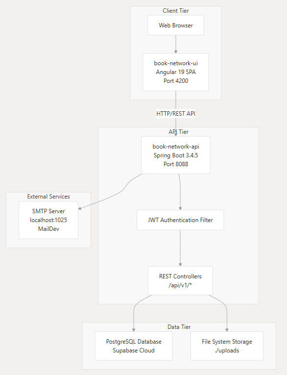
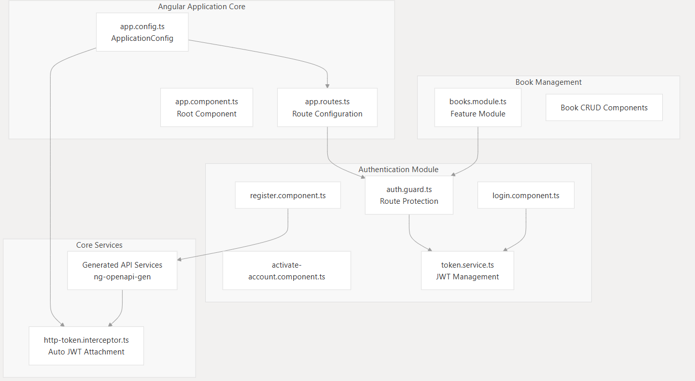
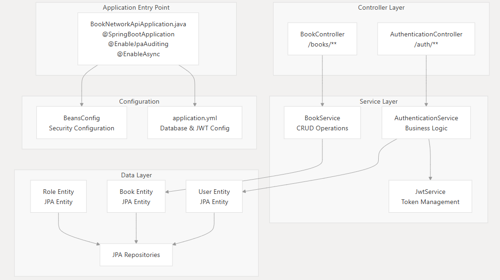

# Book Social Network: Una Red Social para Amantes de la Lectura

El presente repositorio contiene el código fuente del proyecto final de la materia "Entornos de Programación" de la Universidad Industrial de Santander. Un proyecto para crear una red social donde los usuarios pueden conectar, compartir y discutir sobre libros.

## ¿Qué hace la aplicación?

La "Book Social Network" permitirá a los usuarios:

- **Registrarse y Autenticarse**: Los usuarios pueden crear una cuenta y acceder de forma segura.
- **Gestionar Perfiles**: Los usuarios tendrán perfiles personalizados para mostrar sus lecturas, reseñas y actividades.
- **Publicar Contenido**: Los usuarios podrán crear publicaciones, reseñas y compartir sus opiniones sobre libros.
- **Conectar con Otros**: La plataforma facilitará la conexión con otros usuarios, permitiendo seguirse, enviar mensajes y formar comunidades basadas en intereses literarios.
- **Buscar Libros**: Integrará una funcionalidad de búsqueda para encontrar libros específicos.
- **Interactuar**: Los usuarios podrán interactuar con el contenido de otros usuarios, por ejemplo, mediante "me gusta" y comentarios.

## ¿Cómo se estructura la aplicación?

La aplicación se desarrolla como una arquitectura de microservicios, es decir, se divide la aplicación en componentes más pequeños e independientes, para facilitar la gestión y escalabilidad. Las partes clave incluyen:

- **Backend (Servidor)**: Construido con Spring Boot, el backend proporciona las APIs necesarias para el funcionamiento de la aplicación. Maneja la lógica de negocio, la persistencia de datos y la autenticación.
- **Frontend (Interfaz de Usuario)**: Desarrollado con Angular, el frontend crea la interfaz interactiva que los usuarios verán y con la que interactuarán.
- **Base de Datos**: Se utilizará una base de datos relacional (MySQL) para almacenar la información.
- **Keycloak para la Autenticación**: Se integra Keycloak como proveedor de identidad y autenticación para gestionar de forma segura el registro, el inicio de sesión y el control de acceso.
- **Docker para la Contenerización**: Se utiliza Docker para empaquetar cada microservicio y la base de datos en contenedores, simplificando el despliegue.

## Tecnologías Clave Utilizadas

### Backend:
- **Spring Boot (Java)**: Para el desarrollo de la API RESTful y la lógica del servidor.
- **Spring Security**: Para la autenticación y autorización
- **Keycloak**: Para la autenticación y autorización de usuarios.
- **Spring Data JPA**: Capa de acceso de datos

### Database:
- **PostgreSQL**: Base de datos
- **Supabase**: Host de la base de datos

### Frontend:
- **Angular (TypeScript)**: Para construir la interfaz de usuario dinámica e interactiva.
- **HTML/CSS**: Para la estructura y el diseño de la interfaz.
- **TypeScript**
- **BootStrap**
- **JWT Angular**: Para la autenticación

### Otros:
- **Docker**: Para la contenerización y despliegue de los componentes de la aplicación.
- **Maven**
- **OpenApi**
- **npm**

## Características de la Aplicación (Resumen)

- Autenticación segura (Keycloak)
- Gestión de perfiles de usuario
- Publicación de contenido (reseñas, comentarios, actualizaciones)
- Conexión con otros usuarios (seguimiento, mensajes)
- Búsqueda de libros
- Interfaz de usuario intuitiva y responsiva (Angular)
- Arquitectura basada en microservicios, para mayor escalabilidad y mantenibilidad
- Contenerización con Docker, para facilitar el despliegue

## Tecnologías del Frontend

El frontend, construido con Angular, se enfoca en:

- **Presentación de Datos**: Mostrar la información de manera clara y organizada.
- **Interactividad**: Permitir que los usuarios interactúen con la aplicación (ej. hacer clics, escribir, enviar formularios).
- **Navegación**: Proporcionar una navegación fluida entre las diferentes secciones de la aplicación.
- **Diseño Responsivo**: Asegurar que la aplicación se vea y funcione correctamente en diferentes dispositivos (ordenadores, tablets, móviles).

## Meta de la Aplicación

La meta principal del proyecto "Book Social Network" es crear una plataforma social funcional, que conecte a los amantes de la lectura. Además, el proyecto es una excelente exposición de construcción de aplicaciones web y uso de tecnologías modernas como Spring Boot, Angular y Docker, que demuestra las ventajas de la arquitectura de microservicios y el despliegue en contenedores.

## Arquitectura de la aplicación

## Arquitectura del Frontend

## Arquitectura del Backend

